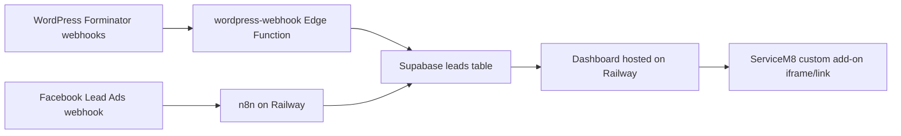

# ServiceM8 Lead Management Dashboard

This project provides a simple Supabase-backed dashboard for tracking incoming leads from WordPress form webhooks and Facebook Lead Ads before they are booked in ServiceM8.

## What is included

- React/Vite dashboard for viewing and tracking leads by source.
- Supabase SQL schema for lead storage, tracking fields, real-time updates, and RLS.
- `wordpress-webhook` Edge Function for direct Forminator / WordPress form ingestion (primary).
- n8n workflow templates for Facebook Lead Ads (and legacy Gmail workflows).
- Deployment guidance for Railway and ServiceM8 embedding.

## Recommended Architecture



**Website leads:** WordPress forms POST directly to Supabase via the `wordpress-webhook` Edge Function. Forminator notification emails may still arrive in Gmail, but leads are **not** parsed from Gmail anymore.

**Facebook leads:** n8n receives the Meta webhook, fetches lead details, and upserts via `ingest-lead`.

## Should the dashboard be deployed to Railway?

Yes, deploy the dashboard to Railway if you want the team to access it from ServiceM8 reliably.

Reasons:

- You already have n8n and PostgreSQL on Railway, so operations stay in one place.
- The dashboard needs a public HTTPS URL to be embedded or linked inside ServiceM8.
- Railway can deploy the Vite build as a small static web service.
- Keeping the dashboard separate from n8n makes it easier to update the UI without touching automations.

Supabase should remain the source of truth for leads. Do not put the Supabase service-role key in the dashboard. The dashboard only uses the anon key and Supabase Auth login.

## Supabase Setup

1. Create a Supabase project.
2. Open the Supabase SQL editor.
3. Run [supabase/schema.sql](./supabase/schema.sql).
4. Optional: run [supabase/seed.sql](./supabase/seed.sql) to insert demo leads.
5. In Supabase Authentication, create users for the team members who should access the dashboard.
6. Copy these values for the dashboard:
   - `VITE_SUPABASE_URL`
   - `VITE_SUPABASE_ANON_KEY`

### Deploy the WordPress webhook API (primary for website leads)

This is the URL you give your WordPress developer — no n8n or Gmail required.

1. Generate a secret for WordPress only, e.g. `openssl rand -hex 32`
2. In Supabase: **Project Settings → Edge Functions → Secrets** → add `WORDPRESS_WEBHOOK_SECRET`
3. Deploy:

```bash
supabase functions deploy wordpress-webhook
```

4. Give your WordPress developer:
   - **URL:** `https://YOUR_PROJECT_REF.supabase.co/functions/v1/wordpress-webhook?secret=YOUR_WORDPRESS_WEBHOOK_SECRET`
   - **Handoff doc:** [wordpress/WEBHOOK.md](./wordpress/WEBHOOK.md)

5. Test:

```bash
curl -X POST "https://YOUR_PROJECT_REF.supabase.co/functions/v1/wordpress-webhook?secret=YOUR_WORDPRESS_WEBHOOK_SECRET" \
  -H "Content-Type: application/json" \
  -d '{"name-1":"Test User","email-1":"test@example.com","phone-1":"0400111222","select-1":"Gas Fittings/Plumbing","textarea-1":"TEST","form_title":"Quote Request","entry_time":"2026-06-13 12:00:00","current_url":"https://emergencyplumbingrepairs.com.au/"}'
```

The API accepts flat JSON or a `fields` array, normalizes Forminator and common form plugin shapes, and upserts into Supabase with `source = wordpress`.

### Deploy the ingest Edge Function (for Facebook / n8n)

Railway n8n often blocks `$env` in workflow expressions. Use the Edge Function for Facebook ingestion — n8n only needs a static URL and one shared secret (no service-role key in n8n).

1. Install the [Supabase CLI](https://supabase.com/docs/guides/cli) and log in.
2. Link your project: `supabase link --project-ref YOUR_PROJECT_REF`
3. Generate a long random secret, e.g. `openssl rand -hex 32`
4. Set it in Supabase: **Project Settings → Edge Functions → Secrets** → add `INGEST_SECRET`
5. Deploy:

```bash
supabase functions deploy ingest-lead
```

6. Test:

```bash
curl -X POST "https://YOUR_PROJECT_REF.supabase.co/functions/v1/ingest-lead" \
  -H "Authorization: Bearer YOUR_INGEST_SECRET" \
  -H "Content-Type: application/json" \
  -d '{"source":"facebook","external_id":"test-1","full_name":"Test User","email":"test@example.com"}'
```

You should get `{"ok":true,"lead":{...}}` and see the row in the `leads` table.

### WordPress webhook vs ingest-lead

| Approach | Best for |
|----------|----------|
| **`wordpress-webhook`** | WordPress / Forminator forms (primary — direct to Supabase) |
| **`ingest-lead`** | Facebook via n8n, or other normalized payloads |
| n8n Gmail workflows | **Deprecated** — was used to parse form notification emails from Gmail |
| n8n WordPress proxy | Optional — only if you need n8n-specific routing logic |

**Why webhooks instead of Gmail?**

Previously, website form submissions triggered notification emails in Gmail, and n8n or `worker/sync-gmail.js` parsed those emails. Direct WordPress webhooks are more reliable, faster, and avoid Gmail parsing issues.

## Local Dashboard Setup

```bash
npm install
cp .env.example .env
npm run dev
```

Update `.env`:

```bash
VITE_SUPABASE_URL=https://your-project.supabase.co
VITE_SUPABASE_ANON_KEY=your-supabase-anon-key
```

Without `.env`, the dashboard opens in demo mode.

## Railway Dashboard Deployment

1. Create a new Railway service from this repository/folder.
2. Add environment variables:
   - `VITE_SUPABASE_URL`
   - `VITE_SUPABASE_ANON_KEY`
3. Set build command:

```bash
npm install && npm run build
```

4. Set start command:

```bash
npm run preview -- --port $PORT
```

5. Generate a Railway domain and confirm the dashboard loads over HTTPS.

## n8n Setup

Import these workflow templates:

- [n8n/facebook-leads-to-supabase.workflow.json](./n8n/facebook-leads-to-supabase.workflow.json) — Facebook Lead Ads (active)
- [n8n/wordpress-forms.workflow.json](./n8n/wordpress-forms.workflow.json) — optional n8n proxy if you prefer not to call Supabase directly from WordPress

### Deprecated Gmail workflows

These parsed form notification emails from Gmail. **Not used** now that WordPress forms POST directly to `wordpress-webhook`:

- [n8n/all email leads.json](./n8n/all%20email%20leads.json)
- [n8n/google-gmail-to-supabase.workflow.json](./n8n/google-gmail-to-supabase.workflow.json)

The Node worker in `worker/` (`npm run sync:gmail`) is also deprecated for the same reason.

### WordPress Forms (direct API — recommended)

Use the Supabase `wordpress-webhook` function (see Supabase Setup above). Hand your WordPress developer [wordpress/WEBHOOK.md](./wordpress/WEBHOOK.md).

**Forminator:** use the built-in Webhook integration. Forminator cannot set custom headers, so put the secret in the URL:

```text
https://YOUR_PROJECT_REF.supabase.co/functions/v1/wordpress-webhook?secret=YOUR_WORDPRESS_WEBHOOK_SECRET
```

No custom PHP is required for Forminator. Notification emails may still land in Gmail, but the dashboard ingests from the webhook, not Gmail.

### WordPress via n8n (optional)

If you already route everything through n8n, import [n8n/wordpress-forms.workflow.json](./n8n/wordpress-forms.workflow.json) instead. WordPress POSTs to n8n, n8n forwards to `ingest-lead`. Use this only when you need n8n-specific logic — otherwise the direct `wordpress-webhook` API above is simpler.

### Facebook Workflow

The Facebook workflow exposes an n8n webhook at:

```text
https://YOUR_N8N_DOMAIN/webhook/facebook-leads
```

Connect that webhook to the Meta App leadgen subscription. The workflow receives the webhook event, fetches the lead details from Graph API, normalizes the fields, and upserts the record into Supabase.

Update the `Normalize Facebook Lead` node if the Facebook form field names differ from:

- full_name or name
- email
- phone_number, phone, or mobile
- service or service_requested
- message, comments, or details

## ServiceM8 Integration

Use the Railway dashboard URL as the ServiceM8 custom add-on/dashboard URL. The team will sign in with Supabase Auth accounts, then view and update leads inside the embedded dashboard.

Re-upload [manifest.json](./manifest.json) after changes (OAuth scopes for job creation are required). Update the add-on function code in ServiceM8 from [servicem8/addon-function.js](./servicem8/addon-function.js).

### Push to ServiceM8 (create job)

When staff click **Push ServiceM8** on a lead, the add-on creates a Quote job with client, job description, and contact details.

**Inside ServiceM8 (recommended):** OAuth is handled automatically via the add-on manifest scopes.

**Direct Railway URL (fallback):** deploy the Edge Function and set a ServiceM8 access token:

```bash
supabase functions deploy push-servicem8
```

In Supabase secrets, add `SERVICEM8_ACCESS_TOKEN` (OAuth access token with `create_jobs`, `manage_job_contacts`, and `manage_customers` scopes).

Run the schema migration in [supabase/schema.sql](./supabase/schema.sql) to add `servicem8_job_uuid` and `servicem8_pushed_at` columns.

If ServiceM8 blocks embedded third-party login screens in an iframe for any tenant/browser policy, use a ServiceM8 custom menu/link that opens the Railway dashboard in a new tab.

## Lead Status Behaviour

Each lead supports:

- `called`: whether the lead has been called.
- `call_attempted`: whether any attempt has been made.
- `notes`: internal call or booking notes.
- **Push ServiceM8**: creates a Quote job in ServiceM8 (client, job, and contact). Pushed rows turn blue and show a link to open the job.

When opened inside the ServiceM8 add-on iframe, push uses the add-on OAuth token automatically. When opened directly on Railway, deploy the `push-servicem8` Edge Function and set `SERVICEM8_ACCESS_TOKEN` in Supabase secrets.

Incoming records are deduplicated with:

```text
source + external_id
```

For WordPress, `external_id` is the Forminator submission ID (or `page_id` + `entry_time`). For Facebook, `external_id` is the Meta lead ID.

## Production Checklist

- Confirm Supabase Auth users are created for all staff.
- Confirm RLS is enabled on `public.leads`.
- Confirm n8n uses the Supabase service-role key only in server-side workflows (or use the Edge Function so n8n never holds the service-role key).
- Confirm the dashboard uses only the Supabase anon key.
- Test one WordPress form submission (Forminator webhook).
- Test one Facebook Lead Ads submission from Meta's testing tool.
- Confirm duplicate test submissions do not create duplicate cards.
- Add the Railway dashboard URL to ServiceM8.
