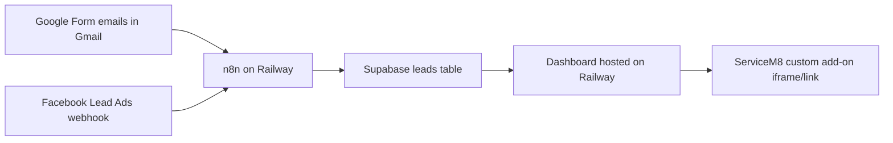

# ServiceM8 Lead Management Dashboard

This project provides a simple Supabase-backed dashboard for tracking incoming leads from Google Form emails and Facebook Lead Ads before they are booked in ServiceM8.

## What is included

- React/Vite dashboard with separate Google and Facebook lead columns.
- Supabase SQL schema for lead storage, tracking fields, real-time updates, and RLS.
- n8n workflow templates for Gmail Google Form leads and Facebook Lead Ads leads.
- Deployment guidance for Railway and ServiceM8 embedding.

## Recommended Architecture



## Should the dashboard be deployed to Railway?

Yes, deploy the dashboard to Railway if you want the team to access it from ServiceM8 reliably.

Reasons:

- You already have n8n and PostgreSQL on Railway, so operations stay in one place.
- The dashboard needs a public HTTPS URL to be embedded or linked inside ServiceM8.
- Railway can deploy the Vite build as a small static web service.
- Keeping the dashboard separate from n8n makes it easier to update the UI without touching automations.

Supabase should remain the source of truth for leads. Do not put the Supabase service-role key in the dashboard. The dashboard only uses the anon key and Supabase Auth login.

## Supabase Setup

1. Create a Supabase project.
2. Open the Supabase SQL editor.
3. Run [supabase/schema.sql](./supabase/schema.sql).
4. Optional: run [supabase/seed.sql](./supabase/seed.sql) to insert demo leads.
5. In Supabase Authentication, create users for the team members who should access the dashboard.
6. Copy these values for the dashboard:
   - `VITE_SUPABASE_URL`
   - `VITE_SUPABASE_ANON_KEY`
7. Copy these values for n8n only:
   - `SUPABASE_URL`
   - `SUPABASE_SERVICE_ROLE_KEY`

## Local Dashboard Setup

```bash
npm install
cp .env.example .env
npm run dev
```

Update `.env`:

```bash
VITE_SUPABASE_URL=https://your-project.supabase.co
VITE_SUPABASE_ANON_KEY=your-supabase-anon-key
```

Without `.env`, the dashboard opens in demo mode.

## Railway Dashboard Deployment

1. Create a new Railway service from this repository/folder.
2. Add environment variables:
   - `VITE_SUPABASE_URL`
   - `VITE_SUPABASE_ANON_KEY`
3. Set build command:

```bash
npm install && npm run build
```

4. Set start command:

```bash
npm run preview -- --port $PORT
```

5. Generate a Railway domain and confirm the dashboard loads over HTTPS.

## n8n Setup

Import these workflow templates:

- [n8n/google-gmail-to-supabase.workflow.json](./n8n/google-gmail-to-supabase.workflow.json)
- [n8n/facebook-leads-to-supabase.workflow.json](./n8n/facebook-leads-to-supabase.workflow.json)

Set these n8n environment variables:

```bash
SUPABASE_URL=https://your-project.supabase.co
SUPABASE_SERVICE_ROLE_KEY=your-supabase-service-role-key
META_PAGE_ACCESS_TOKEN=your-meta-page-access-token
```

### Gmail Workflow

The Gmail workflow polls every 5 minutes and searches for Google Form emails:

```text
from:(forms-receipts-noreply@google.com) newer_than:7d
```

Adjust the Gmail search query if the client receives form notifications from another sender or with a specific subject.

Also update the field parsing in the `Normalize Google Lead` node if the Google Form labels are different from:

- Name
- Email
- Phone or Mobile
- Service or Service Requested
- Message, Comments, or Details

### Facebook Workflow

The Facebook workflow exposes an n8n webhook at:

```text
https://YOUR_N8N_DOMAIN/webhook/facebook-leads
```

Connect that webhook to the Meta App leadgen subscription. The workflow receives the webhook event, fetches the lead details from Graph API, normalizes the fields, and upserts the record into Supabase.

Update the `Normalize Facebook Lead` node if the Facebook form field names differ from:

- full_name or name
- email
- phone_number, phone, or mobile
- service or service_requested
- message, comments, or details

## ServiceM8 Integration

Use the Railway dashboard URL as the ServiceM8 custom add-on/dashboard URL. The team will sign in with Supabase Auth accounts, then view and update leads inside the embedded dashboard.

If ServiceM8 blocks embedded third-party login screens in an iframe for any tenant/browser policy, use a ServiceM8 custom menu/link that opens the Railway dashboard in a new tab.

## Lead Status Behaviour

Each lead supports:

- `called`: whether the lead has been called.
- `call_attempted`: whether any attempt has been made.
- `notes`: internal call or booking notes.
- `booked`: when checked, the lead card changes to blue.

Incoming records are deduplicated with:

```text
source + external_id
```

For Gmail, `external_id` is the Gmail message ID. For Facebook, `external_id` is the Meta lead ID.

## Production Checklist

- Confirm Supabase Auth users are created for all staff.
- Confirm RLS is enabled on `public.leads`.
- Confirm n8n uses the Supabase service-role key only in server-side workflows.
- Confirm the dashboard uses only the Supabase anon key.
- Test one Gmail form submission.
- Test one Facebook Lead Ads submission from Meta's testing tool.
- Confirm duplicate test submissions do not create duplicate cards.
- Add the Railway dashboard URL to ServiceM8.
