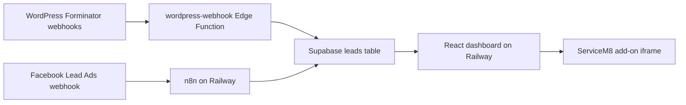

# Lead Management Dashboard — Project Guide

This document is the primary context for AI assistants working on the ServiceM8 Lead Management Dashboard. Read it before making changes.

## Goal

Build a simple visual dashboard embedded inside ServiceM8 so the team can:

- See all incoming leads in one place
- Separate leads by source (WordPress, Facebook)
- Track who has been contacted vs who still needs a call
- Clearly identify booked leads at a glance (blue highlight)
- Reduce missed leads and avoid jumping between WordPress sites, Facebook, and ServiceM8

## Business Requirements

### Lead Sources

Leads are ingested automatically from:

| Source | Ingestion path | `source` value in DB |
|--------|----------------|----------------------|
| **WordPress forms (primary)** | Forminator (or other plugins) → `wordpress-webhook` Edge Function → Supabase | `wordpress` |
| Facebook Lead Forms | n8n webhook → Meta Graph API → `ingest-lead` | `facebook` |
| Gmail parsing (deprecated) | n8n Gmail workflow or `worker/sync-gmail.js` — **no longer used** | legacy enums (`google_form`, site-specific) |

**Important:** Website leads previously arrived as notification emails in Gmail and were parsed from there. The current approach is **direct WordPress webhooks** (Forminator → Supabase). Gmail may still receive notification copies, but the dashboard does not ingest from Gmail.

Handoff doc for WordPress developers: `wordpress/WEBHOOK.md`.

### Dashboard Layout (target UX)

Leads should be displayed in **separate columns by source** so they are easy to identify and manage:

- **WordPress Leads** — one column (website form submissions)
- **Facebook Leads** — one column
- Additional sources may get their own columns or be grouped

> **Current state:** `src/App.jsx` uses a single filterable table, not source columns. Refactoring to a column/kanban layout is a known gap if the team prefers the original spec.

### Lead Tracking (per lead)

Each lead card/row must support:

| Field | Type | Purpose |
|-------|------|---------|
| `called` | checkbox | Lead has been successfully called |
| `call_attempted` | checkbox | Any call attempt was made |
| `notes` | text | Internal notes about the call or booking |

Updates persist to Supabase and sync in real time across open dashboard sessions.

### Booking Status

When a lead is marked **booked**:

- `booked` checkbox is set to `true`
- The lead card/row background changes to **blue** so booked leads are instantly visible

Implemented in CSS via `.leads-table tbody tr.booked` in `src/styles.css`.

## Architecture



**Supabase** is the source of truth. The dashboard uses only the **anon key** (never the service-role key). WordPress ingests via `wordpress-webhook` (service-role inside the Edge Function). Facebook ingests via n8n → `ingest-lead`.

## Tech Stack

| Layer | Technology |
|-------|------------|
| Dashboard UI | React 18, Vite, Lucide icons |
| Database | Supabase (PostgreSQL + Realtime) |
| Automation | n8n on Railway (Facebook) |
| WordPress ingestion | `wordpress-webhook` Edge Function (direct, no n8n) |
| Gmail sync (deprecated) | Node worker in `worker/` — legacy fallback only |
| Edge Functions | Deno (`supabase/functions/`) |
| Hosting | Railway (`leaddashboard-production-adcb.up.railway.app`) |
| ServiceM8 | Custom add-on via `manifest.json` + `servicem8/addon-function.js` |

## Repository Layout

```
Lead/
├── src/
│   ├── App.jsx              # Main dashboard UI
│   ├── main.jsx             # React entry
│   ├── styles.css           # Dashboard styles (booked = blue)
│   └── supabaseClient.js    # Supabase client + config check
├── supabase/
│   ├── schema.sql           # leads table, RLS, realtime
│   ├── seed.sql             # Demo data
│   └── functions/
│       ├── ingest-lead/     # n8n / worker ingestion API
│       └── wordpress-webhook/
├── servicem8/
│   └── addon-function.js    # Embeds dashboard in ServiceM8 iframe
├── worker/                  # Legacy Gmail → Supabase sync (deprecated)
├── n8n/                     # Workflow JSON templates
├── wordpress/               # WordPress webhook handoff docs + PHP
├── manifest.json            # ServiceM8 add-on manifest
├── package.json
├── .env.example
└── README.md                # Setup and deployment guide
```

## Data Model

Table: `public.leads` (see `supabase/schema.sql`)

| Column | Notes |
|--------|-------|
| `id` | UUID primary key |
| `source` | Enum: `google`, `facebook`, `google_form`, `wordpress`, plus site-specific values |
| `external_id` | Stable ID from source (Forminator submission ID, Meta lead ID) |
| `full_name`, `email`, `phone` | Contact details |
| `service_requested`, `message` | Form content |
| `called`, `call_attempted`, `booked` | Tracking booleans (default `false`) |
| `notes` | Free text (default `''`) |
| `raw_payload` | Original payload JSON for debugging |
| `received_at`, `created_at`, `updated_at` | Timestamps |

**Deduplication:** unique index on `(source, external_id)`.

**RLS:** anon and authenticated users can read and update tracking fields. Service role has full access for ingestion.

## ServiceM8 Integration

1. `manifest.json` registers menu item `show_lead_dashboard`.
2. `servicem8/addon-function.js` handles that event and returns HTML with an iframe pointing at `DASHBOARD_URL`.
3. The iframe loads the Railway-hosted React app.
4. Window is resized to 1400×900 via ServiceM8 SDK.

If iframe auth is blocked by browser policy, open the Railway URL in a new tab instead.

## Environment Variables

### Dashboard (`.env`, prefix `VITE_`)

```
VITE_SUPABASE_URL=
VITE_SUPABASE_ANON_KEY=
```

Without these, the app runs in **demo mode** with hardcoded sample leads in `App.jsx`.

### Supabase Edge Function secrets

- `WORDPRESS_WEBHOOK_SECRET` — for `wordpress-webhook` (primary website lead ingestion)
- `INGEST_SECRET` — for `ingest-lead` (used by n8n for Facebook)

Edge Functions also need `SUPABASE_URL` and `SUPABASE_SERVICE_ROLE_KEY` (set automatically when deployed).

### Gmail worker (deprecated — server-side only, no `VITE_` prefix)

Only needed if falling back to Gmail email parsing. Not used for current WordPress webhook setup.

```
SUPABASE_URL=
SUPABASE_SERVICE_ROLE_KEY=
GOOGLE_CLIENT_ID=
GOOGLE_CLIENT_SECRET=
GOOGLE_REFRESH_TOKEN=
```

**Never commit `.env` or secrets.**

## Development Commands

```bash
npm install
cp .env.example .env   # fill in Supabase values
npm run dev            # local dashboard at http://localhost:5173
npm run build          # production build
npm run lint

# Deprecated Gmail worker (only if not using WordPress webhooks):
npm run gmail:auth
npm run sync:gmail
npm run sync:gmail:dry
```

Deploy Edge Functions:

```bash
supabase link --project-ref YOUR_PROJECT_REF
supabase functions deploy wordpress-webhook   # primary for website leads
supabase functions deploy ingest-lead         # for n8n / Facebook
```

## UI Conventions

- Australian date format (`en-AU`) via `Intl.DateTimeFormat`
- Source labels mapped in `SOURCE_LABELS` in `App.jsx`
- Optimistic updates on checkbox changes; revert on Supabase error
- Realtime subscription on `public.leads` when Supabase is configured
- Stats bar: Total, Needs Call, Called, Booked
- Filters: search, source, called, attempted, booked
- CSV export of filtered leads
- Expandable rows for message + notes

When adding a new lead source:

1. Add enum value in `supabase/schema.sql` if needed
2. Add label in `SOURCE_LABELS` and optional icon in `SourceIcon`
3. Add ingestion workflow (n8n JSON or Edge Function)
4. Add CSS for `.source-badge.{source}` if distinct styling is needed

## Ingestion Endpoints

| Endpoint | Auth | Used by |
|----------|------|---------|
| `POST /functions/v1/wordpress-webhook` | `X-Webhook-Secret`, `?secret=`, or `Authorization: Bearer` | **WordPress / Forminator (primary)** |
| `POST /functions/v1/ingest-lead` | `Authorization: Bearer INGEST_SECRET` | n8n (Facebook) |

### WordPress webhook (primary)

Forminator POSTs field keys like `name-1`, `email-1`, `phone-1`, `select-1`, `textarea-1`. Normalization lives in `supabase/functions/_shared/normalize-wordpress.ts`.

Forminator cannot set custom headers — put the secret in the URL:

```text
https://YOUR_PROJECT_REF.supabase.co/functions/v1/wordpress-webhook?secret=YOUR_WORDPRESS_WEBHOOK_SECRET
```

Example test payload:

```json
{
  "name-1": "Jane Doe",
  "email-1": "jane@example.com",
  "phone-1": "0400111222",
  "select-1": "Gas Fittings/Plumbing",
  "textarea-1": "Blocked drain",
  "text-1": "Sydney",
  "form_title": "Quote Request",
  "entry_time": "2026-06-13 12:00:00",
  "current_url": "https://emergencyplumbingrepairs.com.au/"
}
```

Saved as `source: "wordpress"`. `external_id` comes from Forminator hidden submission ID, or `page_id` + `entry_time`.

### ingest-lead (Facebook / legacy)

```json
{
  "source": "facebook",
  "external_id": "unique-id-from-source",
  "full_name": "Jane Doe",
  "email": "jane@example.com",
  "phone": "0400111222",
  "service_requested": "Blocked drain",
  "message": "Optional message"
}
```

## Coding Principles

1. **Minimize scope** — small, focused diffs; don't refactor unrelated code
2. **Match existing style** — React hooks, Lucide icons, CSS variables in `styles.css`
3. **No over-engineering** — no unnecessary abstractions or error handling for impossible cases
4. **Security** — anon key in dashboard only; service-role and ingest secrets server-side only
5. **Don't create markdown files** unless explicitly requested (this file was requested)

## Known Gaps / Future Work

- [ ] **Column layout** — requirements specify WordPress/Facebook columns; current UI is a unified table with source filter
- [ ] **Supabase Auth** — README mentions team login; dashboard currently uses anon key with open RLS read/update
- [ ] **React key warning** — `App.jsx` maps leads with `<>` fragment without a key on the outer element
- [ ] **Per-site WordPress sources** — all webhook leads save as `wordpress`; may want site-specific `source` values (e.g. `emergency_plumbing_sydney`) based on `current_url`

## Quick Reference

| What | Where |
|------|-------|
| Lead schema + RLS | `supabase/schema.sql` |
| Dashboard UI | `src/App.jsx`, `src/styles.css` |
| ServiceM8 embed | `servicem8/addon-function.js`, `manifest.json` |
| n8n workflows | `n8n/*.json` |
| Setup docs | `README.md` |
| WordPress handoff | `wordpress/WEBHOOK.md` |
| Production URL | `https://leaddashboard-production-adcb.up.railway.app` |
